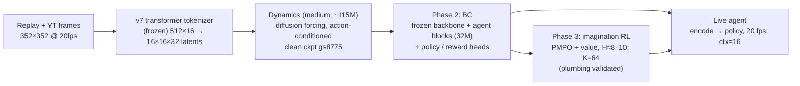
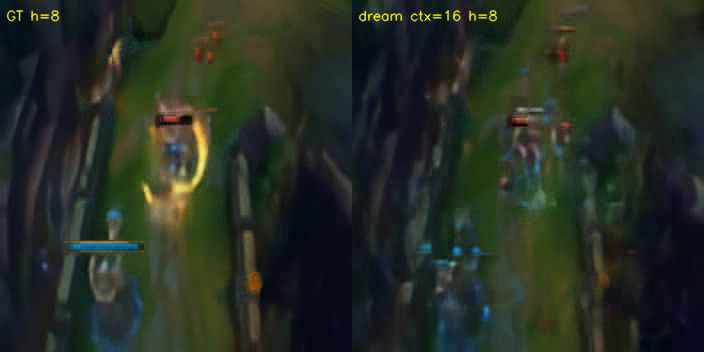
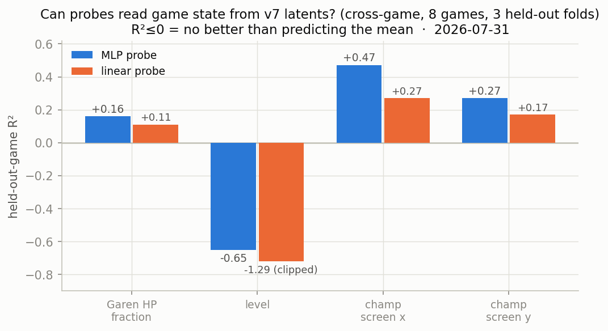
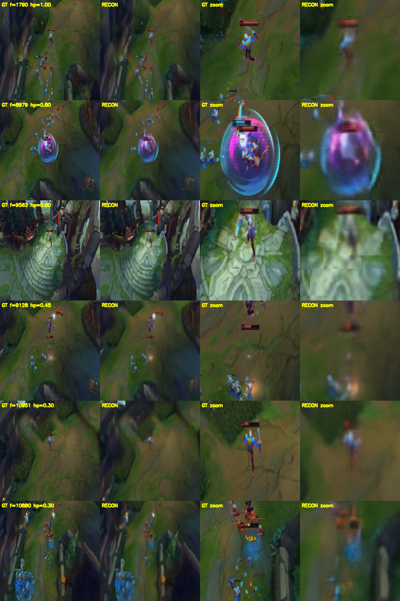
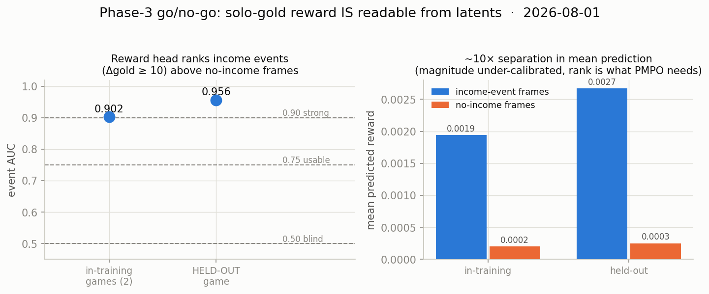
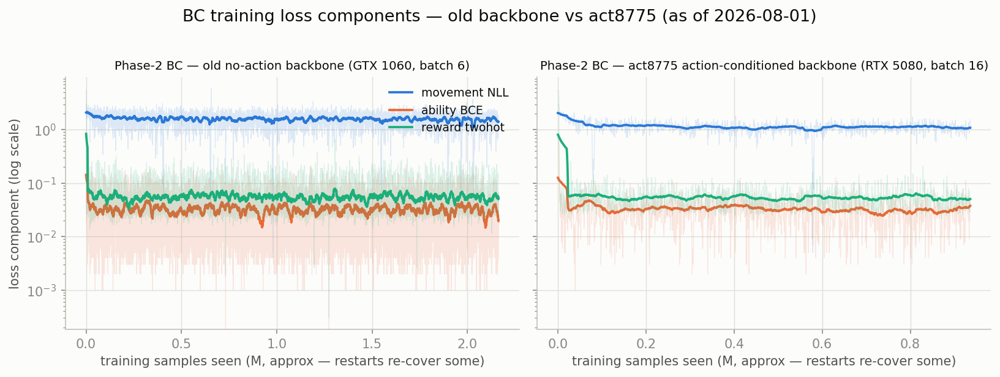
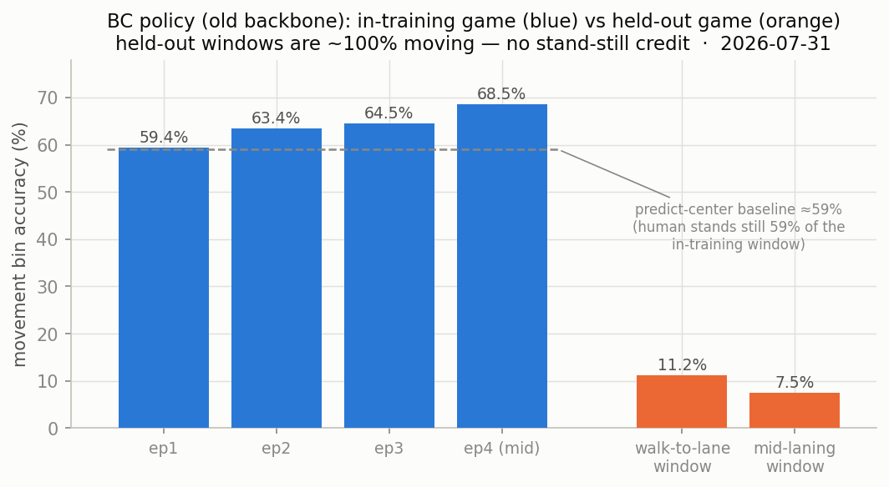

# ahriuwu: DreamerV4-Style World Model for Autonomous League of Legends Play

**Repository:** `daniyal-rahman/ahriuwu`
**Task domain:** League of Legends — Garen top lane, laning phase
**Core idea:** Learn a latent world model from replay/video frames, train a behavior-cloned agent on top of it, then improve the agent with imagination (dream) RL — and run it live at 20 fps.

## Pipeline



- **Tokenizer (frozen):** v7 transformer tokenizer, 512 latents × 16 dim, folded `view(16,16,-1)` to a 16×16 grid of 32 channels (the same 512-bottleneck → 256-spatial reshape DreamerV4 uses). Replay recon ≈ 26.8 dB.
- **Dynamics:** medium (~115M backbone; 146M with agent blocks), plain diffusion forcing, KV-cached rollout. The **clean base checkpoint is `dynamics_accel` gs8775** — replays-only, action-conditioned (`use_actions=True`). Correct sampling regime for this lineage is **K=64** (K=4 shortcut sampling needs a shortcut fine-tune the model hasn't had; `finetune_shortcut.py` exists).
- **Agent:** Phase-2 BC trains 32M agent-token blocks + policy/reward heads against the frozen backbone; Phase-3 trains policy/value inside dreams (PMPO, λ-returns). Live play never dreams — it encodes real frames and queries the policy (tiny/small/medium clear 20 fps with the KV cache).

## Current status (2026-08-01)

Everything below is measured, with in-training vs held-out flagged explicitly.

### World model: coherent short dreams, clean of HUD artifacts


*Ground truth vs dream 8 frames in, replays-only gs8775 model at K=64 (2026-07-31). Entity-coherent dreams hold to **h≈10 (~0.5 s at 20 fps)** — visually confirmed — which covers the last-hit / trade / spacing decision timescale. Champions ghost around h8–16; terrain and camera hold much longer.*

Notes that got us here: absolute PSNR-to-realized-future is not the paper's metric and can't saturate in a stochastic game (the "plateau" was substantially metric artifact); a YT-mixed retrain re-introduced black-HUD contamination and was discarded — replays-only is the base going forward; visual inspection of decoded dreams is the primary eval (two automated metrics were caught rating a poisoned model above the clean one).

### Perception: HP/level are NOT reliably in the latents (measured two ways)


*Cross-game probes (8 games, 3 held-out folds, 2026-07-31): a nonlinear MLP barely beats linear on Garen HP (R² 0.16 vs 0.11) and both lose level entirely — the signature of information missing from the latent, not probe weakness. Champion screen position is partially preserved.*


*Decode-side check on a held-out game (rows span HP 1.00 → 0.30; GT | recon | zooms, 2026-07-31). Owner's verdict: HP bars "kinda there but not clearly, not accurate to ±10%, in some of em p mangled." The recon also erases the "+14" gold popup (row 6).*

**Mitigation (chosen over tokenizer surgery):** scalar state doesn't need to travel through pixels. Training uses exact HP/level/gold from replay labels; live play reads Garen's own stats from the League client's local Live Client Data API (port 2999). Enemy state is fully labeled too (`visible_heroes` carries hp/hp_max/level/gold on every entry), enabling an auxiliary supervised head to force enemy-state semantics into the agent representation. Tokenizer retraining re-enters only if aux supervision proves insufficient.

### Reward: GO for Phase-3


*The Phase-2 reward head ranks income events (Δgold ≥ 10, i.e. last hits) above no-income frames from latents alone: **event AUC 0.902 in-training, 0.956 on a fully held-out game** (2026-08-01). Magnitude calibration is rough (corr 0.30, R² 0.06) but PMPO consumes advantage sign/rank, which is what's strong.*

### Policy (Phase-2 BC): two runs, honest held-out numbers


*Loss components for both BC runs (log scale, as of 2026-08-01). Right: the **act8775 run on the action-conditioned clean backbone (RTX 5080, 13.5 samp/s, ~8.7 h/epoch, launched 2026-08-01)** — the Phase-3-compatible Phase-2 — already at lower movement loss (~1.55 in epoch 2) than the old-backbone run reached after ~4 epochs (~1.86). Left: the old no-action-backbone baseline run (GTX 1060, ~2 samp/s). Both run under watchdogs with 20-minute checkpoints and auto-resume.*


*Old-backbone policy, simulated frame-by-frame eval (`eval_bc_sim.py`, 800 frames, 2026-07-31). In-training movement bin-accuracy climbs 59.4 → 68.5% across epochs but sits near the predict-center baseline; on a **held-out** game it drops to 7.5–11.2% (windows where the human moves ~100% of the time). It beats center-baseline MAE (0.054–0.095 vs 0.080–0.116) — directional signal, far from imitation. Read: the policy learned when to stand still, not yet where to go; abilities over-trigger on held-out (AA ~50× human rate at the calibrated threshold). This is the baseline the act8775 run must beat.*

### Imagination (Phase-3): plumbing validated end-to-end

`train_imagination.py` ran on real data (1060, H=4, K=8): on-policy dreaming via the KV-cached rollout, λ-returns, PMPO + factorized KL, value twohot, checkpoint save — all exercised. One real bug found and fixed (dataset fp16 latents fed raw into fp32 `rollout()`). The learning signal was degenerate exactly as predicted for the old **non-action** backbone (dreams can't respond to the policy's actions → all-positive advantages, KL≈0): real Phase-3 waits for the act8775 BC checkpoints, whose backbone is action-conditioned.

## Roadmap

1. **act8775 BC epochs** on the 5080 → evaluate each with the held-out protocol (`eval_bc_sim.py --window`, held-out latents in `replay_latents_v7_heldout`).
2. **Aux state head:** supervised own+enemy HP/level from labels, forcing game semantics the tokenizer garbles into the agent tokens.
3. **Phase-3 imagination** at H=8–10, K=64 on the best act8775 checkpoint (reward head already validated).
4. **Live e2e** on Windows: capture → encode → policy → input injection, with own-stats sidecar from the Live Client Data API.
5. Later / paid levers: longer entity persistence in dreams (capacity + cloud training), shortcut fine-tune only if fast dreaming is ever needed (the live agent doesn't dream), data-level HUD fix if YT data is ever re-admitted to dynamics training.

## Repository map

- [`src/ahriuwu/models`](src/ahriuwu/models): tokenizer, dynamics (KV-cached rollout), heads, losses, returns
- [`src/ahriuwu/data`](src/ahriuwu/data): replay/YT ingestion, latent datasets (`ReplayLatentSequenceDataset`, packed latents), action parsing
- [`src/ahriuwu/rewards`](src/ahriuwu/rewards): solo-gold reward (Δ own `gold_total` + death penalty)
- [`scripts`](scripts): training / eval / data CLI entry points (see below)
- [`docs`](docs): progress notes, audits, analyses; README figures in [`docs/assets`](docs/assets)

## Usage (current entry points)

```bash
# Pretokenize replay frames with the frozen v7 tokenizer (one packed .pt per match)
PYTHONPATH=src python scripts/pretokenize_replay_v7.py --checkpoint <v7.pt> \
  --frames-root <frames> --out <latents_dir>

# Dynamics (world model) training on packed latents
PYTHONPATH=src python scripts/train_dynamics.py --latents-dir <latents_dir> \
  --packed --latent-dim 32 [--use-actions --labels-root <labels>]

# Phase 2: BC + reward on the frozen backbone
PYTHONPATH=src python scripts/train_agent_finetune.py \
  --dynamics-checkpoint <backbone.pt> --model-size medium --num-kv-heads 4 \
  --latents-dir <latents_dir> --labels-root <labels> \
  --resume auto --checkpoint-minutes 20

# Phase 3: imagination (PMPO + value) from a Phase-2 checkpoint
PYTHONPATH=src python scripts/train_imagination.py \
  --agent-checkpoint <phase2.pt> --latents-dir <latents> --labels-root <labels> \
  --model-size medium --num-kv-heads 4 --horizon 8 --gen-steps 64

# Evals
PYTHONPATH=src python scripts/eval_dream_quality.py --ckpt <dyn.pt> --tokenizer-ckpt <v7.pt>  # dreams + FVD-style + mp4
PYTHONPATH=src python scripts/eval_bc_sim.py --phase2-ckpt <phase2.pt> --match <id> --window 2  # imitation accuracy
PYTHONPATH=src python scripts/eval_reward_head.py --phase2-ckpt <phase2.pt> --matches <id>      # reward event-AUC
PYTHONPATH=src python scripts/probe_hp_mlp.py                                                   # latent legibility
```

## Historical results (superseded)

Early-2026 results kept for provenance, no longer the current picture: the CNN-vs-transformer tokenizer comparison (issue #6; the v7 *transformer* tokenizer is the production choice for the dynamics stack) and the March Phase-2 numbers (issue #7: top-1 48.1% — measured in-training under the old pipeline; the honest held-out protocol above replaces it).

## Citation

```bibtex
@misc{ahriuwu2026,
  author = {Rahman, Daniyal},
  title = {ahriuwu: LoL Autonomous Agent Using DreamerV4-Style World Model},
  year = {2026},
  howpublished = {\url{https://github.com/daniyal-rahman/ahriuwu}}
}
```
