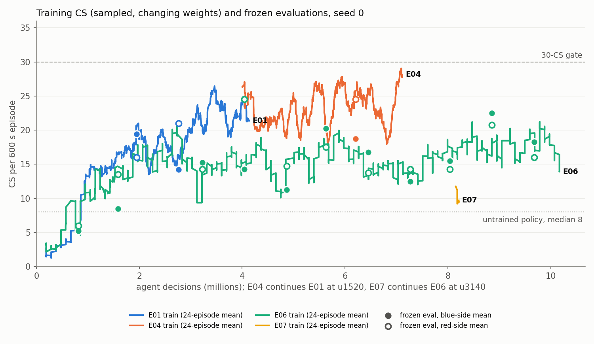
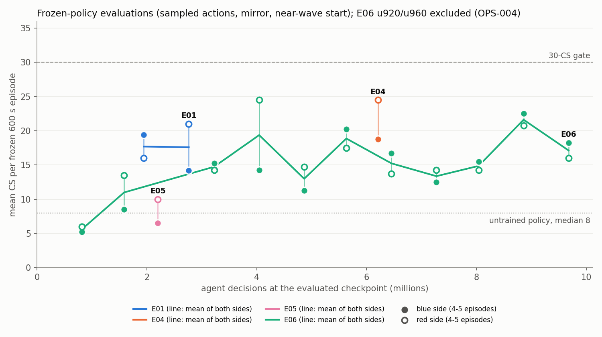
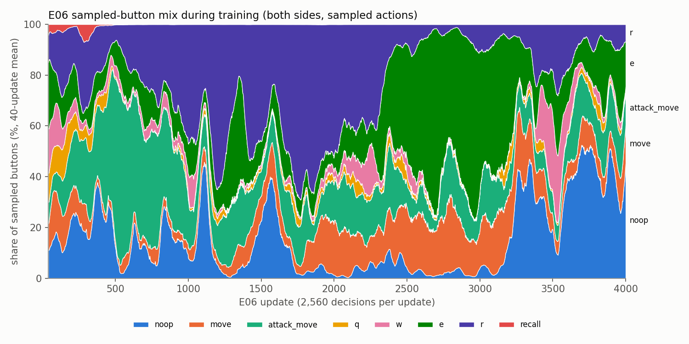
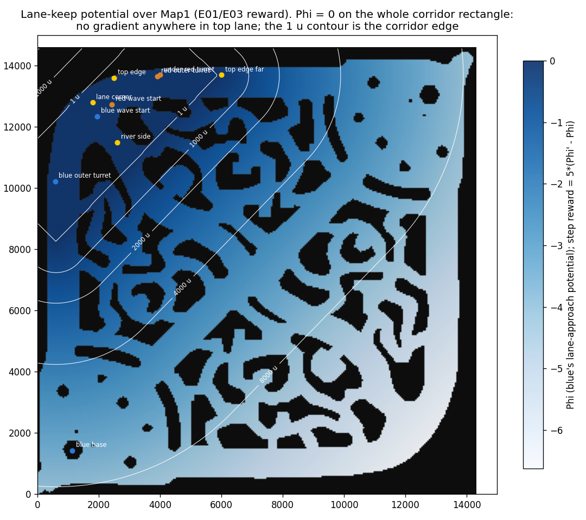
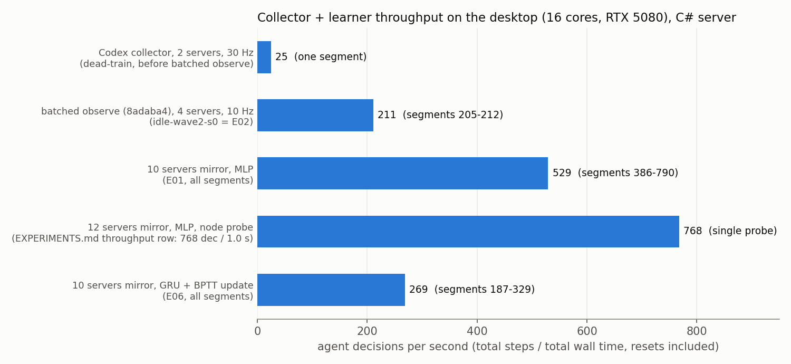
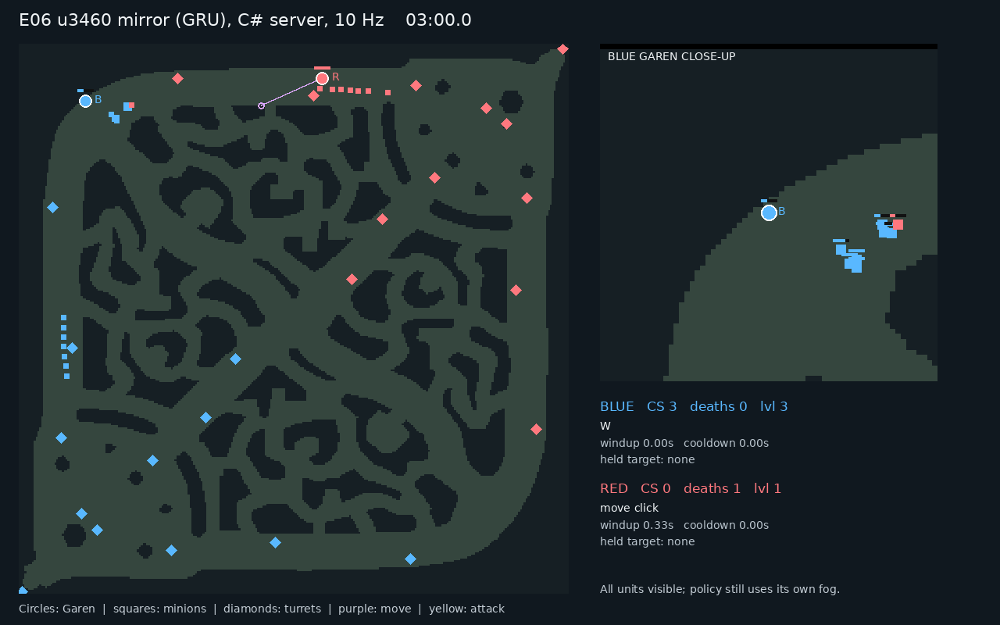
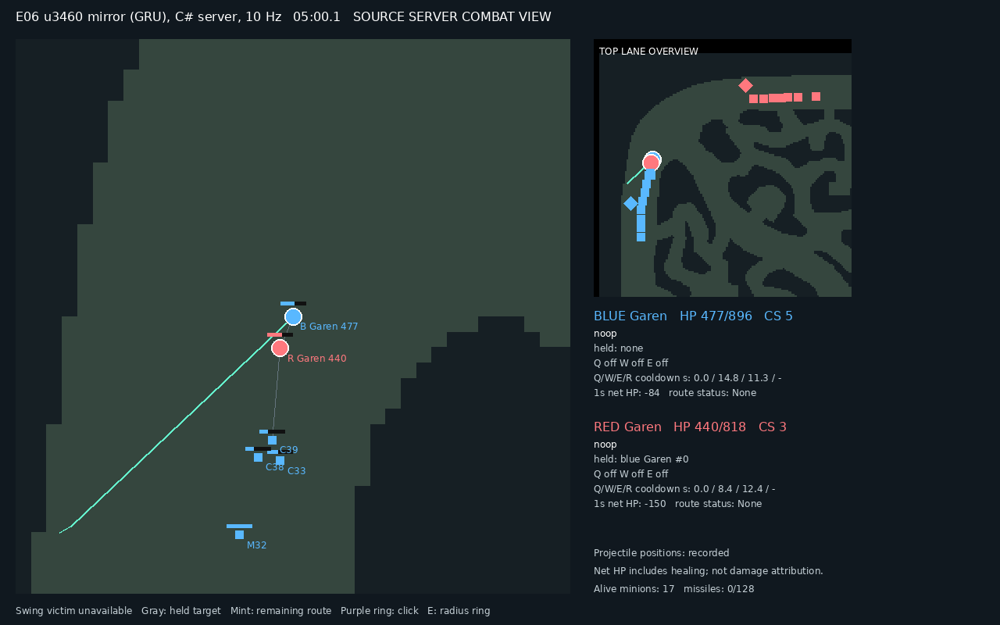

# Learning to last-hit from scratch: PPO in a Garen mirror lane on the LeagueSandbox C# server

**Abstract.** We train a randomly initialised PPO policy, with no demonstrations and no reference loss,
to farm a ten-minute Garen-vs-Garen top lane on the source-available LeagueSandbox C# server, acting
only through screen clicks on a champion-centred camera. The gate is **>30 CS per frozen 600 s
episode, over seeds**. Seed 0 has not reached it. The best frozen checkpoint is E06 update 3460
(GRU core, published PPO defaults): **22.5 blue / 20.8 red**. Over 11 frozen evaluations after
4M decisions, E06 sits in a 13-22 CS band (mean ~17). E04 (MLP, legacy config, with the wall-click fix)
scored 18.8 / 24.5 in its one frozen evaluation. The untrained policy scores a median of 8. Most of
the gains came from fixing bugs in the environment and the objective, not from tuning (§3). The open
question now is whether the plateau is self-play drift into duelling; E07 tests that against a frozen
opponent (§4).

- **[STATUS.md](STATUS.md)** — what is running, what was just done, what is next. Read this first.
- [docs/EXPERIMENTS.md](docs/EXPERIMENTS.md) — every run, one row, with verdict.
- [docs/CODEMAP.md](docs/CODEMAP.md) — which code is live, tooling, diagnostic or legacy.
- [docs/JAX_FIDELITY_LEDGER.md](docs/JAX_FIDELITY_LEDGER.md) — the lab notebook: every finding as a row.
- [docs/PROJECT.md](docs/PROJECT.md) — scope and roadmap; [docs/EXPERIMENT_METHOD.md](docs/EXPERIMENT_METHOD.md) — how experiments are contracted.
- [lanerl/patches/README.md](lanerl/patches/README.md) — server patches and which build is canonical.
- [AGENTS.md](AGENTS.md) — working rules for agents.

## 1. Setup

**Server.** The environment is LeagueSandbox (`/srv/nfs/projects/lanerl-vendor/LoLServer`) with six
patches applied in order ([lanerl/patches/README.md](lanerl/patches/README.md)):
`screen-click-v1` (click order with a hit test on collision circles), `server-q-cast-freeze`
(SERVER-001), `screen-click-v2` (ground A-click = AttackMove; auto-acquire needs visibility),
`server-hud-ability-state` (own slot-enabled bits), `server-dead-control` (authoritative dead flag),
and `screen-click-v3` (PATH-011). The canonical build is `bin/ClickV3`, used from E04 onward; E01-E03 ran on
`DeadProbe`, which has the first five patches. Each environment is one server process on one core,
with two champions. Episodes reset by starting a fresh process, which preserves runes and base stats.

**Actions.** The policy has three factored heads: a button from `noop, move, attack_move, q, w, e, r,
recall`, and an x and a y cell on a **96 x 54 screen grid**. The grid is projected through a locked,
champion-centred perspective camera (`lanerl_rl/projection.py`). The server resolves each click as the
real client would: hostile hit test, A-move acquisition, and walkable-point snapping after PATH-011.
At screen centre a cell covers 30 x 36 world units, smaller than a minion. A live probe
(`lanerl_jax/probes/screen_click_probe*.py`, STATUS) confirmed that clicks acquire targets for both sides.
The policy acts at 10 Hz (6 server ticks per decision). Unranked or disabled spells collapse to `noop`.

**Observations** (`viewport-structured-v3`): 32 entity slots x 16 features, a 16-d self vector and a
6-d global vector. Only entities inside the canonical viewport and visible under the server's own
team fog (`vb`/`vr` flags, including brush) are included. Own ability availability comes from the HUD bits.

**Reward** (`train/server_train.farm_reward`): **+1 per CS, -2 per death**, plus lane-approach shaping
**5 per 10,000 u** of corridor distance, paid as the *undiscounted* potential difference (REW-11), plus
**0.002 per XP**. The server grants XP only for enemy-minion deaths (SIDE-001).

**Start state.** Both champions are walked to their first wave by a scripted route. The episode starts
at 120 s, so the policy controls the remaining 480 s (4,800 decisions per agent).

**PPO** ([docs/HYPERPARAMS.md](docs/HYPERPARAMS.md); `PPOConfig.standard()`, E05-E07):

| Parameter | Standard (E05-E07) | E01-E04 (legacy) |
|---|---|---|
| Optimiser | Adam, eps 1e-5 | same |
| lr | 2.5e-4, linear anneal to 0 | 3e-4 constant |
| gamma | 0.99917 (120 s horizon at 10 Hz) | same |
| GAE lambda | 0.95 | 0.97 |
| Clip | 0.2 (dual clip 3.0) | same |
| Value coef | 0.5, clipped | same |
| Entropy | 0.01 per head = 0.01/3 on the 3-head sum | 0.001 |
| Max grad norm | 0.5 | 1.0 |
| Epochs x minibatches | 4 x 4 | same |
| Advantage norm | per minibatch | off |
| KL early stop | none | 0.02 |
| Rollout | 128 steps | same (E03/E04: 256) |
| Core | GRU, BPTT over the rollout | MLP |
| Envs | 10 servers x 2 agents, mirror self-play | same (E03/E04: 6) |

**Throughput.** See Fig. 5: collection is bound by server CPU at roughly 14 servers, not by Python.

## 2. Experiments

| ID | Question | Config delta | Result (frozen unless marked) | Verdict |
|---|---|---|---|---|
| E01 | Does mirror self-play from the near-wave start learn? | MLP, legacy PPO, DeadProbe | u760 19.4 / 16.0; u1080 14.2 / 21.0; train flat 16-18 from ~u500 | plateau; control |
| E02 | Same, vs an idle red | idle opponent, 4 envs | train 4 → ~10 by 190 episodes | superseded |
| E03 | Is the plateau a step size problem? | E01 u1120, lr 1e-4 | stopped after ~90 updates, no evaluation | superseded by E04 |
| E04 | Do wall clicks and XP camping explain the plateau? | E01 u1520, ClickV3, XP 0.002 | u2020 **18.8 / 24.5**; train chunks 22-31 | largest single gain; stopped by a reboot |
| E05 | Published defaults + GRU from scratch | standard, entropy 0.01 on the head sum | u860 6.5 / 10.0; entropy pinned at 9.0 | entropy 3x too strong |
| E06 | E05 with entropy 0.01 per head | entropy 0.0033 on the sum | best u3460 **22.5 / 20.8**; band 13-22 | plateau ~17; control |
| E07 | Is the plateau self-play drift? | E06 u3140 params (`--init-from`), vs FROZEN E06 u2200, 6 servers x 256 | running: u~120 of 3000, no frozen eval yet | open |

A first E07 attempt (`seed0_v1_inherited_schedule`) inherited E06's update counter and lr schedule,
so it trained 767 updates at near-zero lr. It is recorded as INVALID.



**Figure 1.** Training CS per agent episode (24-episode rolling mean) and frozen evaluations (filled = blue side, open = red).
E04 branches from E01 at 3.9M decisions, E07 from E06 at 8.0M. E04's training
curve (20-28) sits well above E06's (14-20) at the same decision count. E04 inherited E01's 1,520
updates, and its one frozen evaluation (18.8 / 24.5) is only one point, so this is not evidence that
the MLP is better. Training CS matches frozen CS to within the evaluation noise.



**Figure 2.** Frozen evaluations only (4-5 episodes per side, sampled actions). E06 rises from the untrained level (5.3 / 6.0 at u320)
to ~15 by 3.2M decisions, then moves within a 13-22 band for 6.5M more decisions. The spread
within one evaluation is large (u3460 blue: 16-31 per episode), so the band is noise around a flat mean, not a trend.
E06 u920/u960 are excluded as invalid (OPS-004).



**Figure 3.** E06's sampled-button mix (40-update mean). The mix never converges. It swings from
attack-move (~45% near u600) to R (up to 69% of a 40-update window near u1250) to E (the spin, ~50-70% at
u2600-3000) to noop (~40-50% at u3700). Over the run R makes up 24.3% of sampled buttons, but **68% of those R presses
came before R was ranked** and executed as `noop`. The drift is between spin-heavy and idle
strategies at a steady ~15-20 CS. Policy entropy stays at 6.7 nats (u3300-4000 mean).



**Figure 4.** The lane-approach potential Phi over Map1 (blue's side). **Phi = 0 across the whole
top-lane corridor rectangle**, so shaping has no gradient anywhere in lane. It only pulls a
champion back to the corridor edge and cannot favour one position near the wave over another. After REW-11 it
cannot be farmed by standing still, and within the lane it is silent.



**Figure 5.** Agent decisions per second, computed from `metrics.jsonl` (`steps` over `wall_s`, resets included) by
`ops/figures/readme_figures.py`, except the 12-server probe (EXPERIMENTS.md throughput row). The Codex collector
(2 servers, 30 Hz) ran at 25/s. It spent ~4 ms per env per decision in eager JAX observation building
(`probes/profile_collector.py`). Batched host-side observe (`8adaba4`) brought 4 servers to 211/s and
10 mirror servers to 386-790/s depending on node sharing. `--workers 3` gave the same 768/s as one worker, so
the node is server-CPU bound. The GRU's BPTT update drops E06 to 187-329/s (STATUS: 12 s/update before the
leak fix, 7.4 s/update after it, i.e. ~213 and ~346/s).




**Figure 6.** One frozen mirror episode of E06 u3460, rendered by `lanerl_jax/probes/replay_episode.sh`.
At 03:00 (top) both champions stand at their waves. At 05:00 (bottom) red holds blue as its attack
target beside the wave. By then the two sides have 5 and 3 CS, and blue is at 477/896 HP.

## 3. Findings: the bugs that changed learning

| Finding | Symptom | Mechanism | Fix | Ref |
|---|---|---|---|---|
| Dead learner | Codex runs: uniform buttons after 684 updates, CS 0-19 | lr 1e-5 with 256-decision batches: clip fraction 0.0, approx KL 5e-5 (last 100 updates) | lr 3e-4 / 2.5e-4 | EXPERIMENTS row 1 |
| Shaping leak | `recall` 96% of actions by u48, champion sits in the fountain | `gamma*Phi' - Phi` with Phi <= 0 paid (1-gamma)abs(Phi) per step for standing still, +0.0033/step | undiscounted `Phi' - Phi`, real terminal potential; telescoping tests | REW-11 |
| Entropy bias | move/attack_move/R at 1/3 each, entropy 9.6, CS 0.1 over 886 episodes | usage-weighted `H_b + p_screen(H_x+H_y)` pays +0.67 nats for each coordinate button | unconditional per-head sum | PPO-15 |
| Wall clicks | E01 replay: 46-54% of movement clicks on unwalkable ground; edge hugging | a null `GetPath` fell back to a straight line into terrain | server snaps to the closest reachable point (ClickV3) | PATH-011 |
| XP camping | both champions camp the brush beside the wave | XP term (0.005) paid 1.11x the CS term; it IS enemy-only (52/54 XP rises had an enemy death nearby) | weight 0.002 | SIDE-001 |
| Port collisions | 3 runs died at resets with exit 97 | control ports 49700+ lay in the kernel's ephemeral range | base 21300, port rotation, bases < 32768 | OPS-003 |
| Rank loop | E06 train CS 15 → 2 between u760-900; frozen u920 2.5 / 1.5 | table asked for a skill point the champion lacked; 18 retries x 6 ticks → one decision per 1.9 s past level 9 | never ask beyond `sum(ranks) >= level`; E06 resumed from u620 | OPS-004 |
| Memory leak | E06 OOM-killed at u1931 (10 GB) | eager `loss.forward` re-traced its scan every update, ~10 MB each | jit once; +2.4 MB/update | commit `1a89b8e` |
| Entropy scale | E05: entropy pinned at 9.0, frozen 6.5 / 10.0 at 2.3M | CleanRL's 0.01 is per head; applied to a 3-head sum it is 3x | 0.01/3 (E06) | HYPERPARAMS, E05 row |

The E01-E04 numbers were affected past level 9 by OPS-004, and every curve before REW-11 is not comparable.

## 4. Where it plateaus, and why we think so

E06 learned from 5.3 / 6.0 to ~15 in 3.2M decisions, then stayed at 13-22 for 6.5M more (Fig. 2).
It is not an entropy collapse: entropy stays at 6.7 nats. It is not a learning-rate stall either: the lr
anneals over 6,000 updates and the median approx KL per update is still 4e-3 to 1e-2 (u1000-3800). The policy keeps *moving* (Fig. 3)
without improving. The working hypothesis is **self-play drift into duelling**. Each side's best response
to a changing mirror opponent is to fight it, and fighting costs CS: frozen evaluations record 2.4-3.3
deaths per agent per episode (from the `eval_u*.out` files), and training averages 2.7 (u3300-4000, from `reward_death`).
The replay shows the champions trading beside the wave (Fig. 6). We have not measured how much of this
is duelling as opposed to dying to minions and turrets.

**E07** keeps E06's learner (params from u3140, fresh optimiser and schedule, a 3,000-update budget) and
freezes the opponent at E06 u2200. The learner's side alternates per server. If drift is the cause,
CS against a fixed opponent should climb out of the band. As of this commit E07 has completed ~120 updates
(36 learner episodes, mean train CS 11.8) and has no frozen evaluation yet. The spec (`experiments/E07_frozen_opponent.json`)
states the question, but neither it nor STATUS.md records a quantitative decision rule. Its frozen evaluations will be
compared with E06's 13-22 band.

## 5. Reproduction

```bash
# training: the only way a run starts (AGENTS.md rule 1). Spec: experiments/<ID>.json
ops/launch.py E07 --dry-run          # resolve paths, refuse bad ports/checkpoints
ops/launch.py E07 [--seed N] [--init-from CKPT]   # canary (1 server, 2 updates, ~3 min), then sbatch
# frozen evaluation through the same collector
ops/launch.py eval --ckpt RUN/eval_uN.msgpack [--opponent frozen --opponent-ckpt CKPT] --envs 4
ops/periodic_eval.sh lanerl_jax/runs/<ID>/seed0 300   # every 300 updates -> runs/EVAL/summary.jsonl
# progress, replays, figures
ops/server_train_status.py lanerl_jax/runs/<ID>/seed0
CKPT=... OUT=lanerl_jax/runs/EVAL/replay_<tag> LABEL="..." lanerl_jax/probes/replay_episode.sh
ops/login_capped.sh 4G 1 env JAX_PLATFORMS=cpu .venv-jax/bin/python ops/figures/readme_figures.py
```

Run directories (`lanerl_jax/runs/`, git-ignored) hold the manifest, `metrics.jsonl`, checkpoints
and a source tarball. Runs execute on the desktop Slurm node; server ports stay below 32768.

## 6. Limitations and next steps

- **One seed.** Every number above is seed 0. RL-007 found farming discovery non-reproducible
  across seeds on the JAX simulator, and the gate requires several seeds.
- **Small evaluations.** Frozen evaluations use 4-5 episodes per side with sampled actions. The
  per-episode range (e.g. 16-31) is wider than the differences between checkpoints.
- **Confounded comparisons.** E04 and E06 differ in core, PPO config, envs and inherited updates.
  No matched ablation separates them, and E01-E04 carry OPS-004 past level 9.
- **Open instrumentation.** Basic-attack completions are not attributed (zero logged in a 20-CS
  episode), and ENT-02 vs AA-007 (mid-windup retarget) is unmeasured. The Anakin JAX trainer (`trainer.py`) still has
  the PPO-15 bias.
- **Throughput.** 187-329 decisions/s buys ~1M decisions per hour. The legacy `procactor.py`
  collector reached 4,829/s at 96 servers (CODEMAP) and has not been ported.
- **JAX simulator paused.** The matched JAX comparison (`lanerl_jax/sim/`, `train/jax_train.py`)
  waits until the C# gate is met. Its fidelity questions stay in the ledger, not here.
- **Next:** read E07's frozen evaluations against E06's band. If drift explains the plateau, adopt a
  frozen/league opponent schedule and run seeds 1-2. If not, the next suspects are the objective
  (per-CS reward vs death penalty) and the silent in-lane shaping (Fig. 4).
