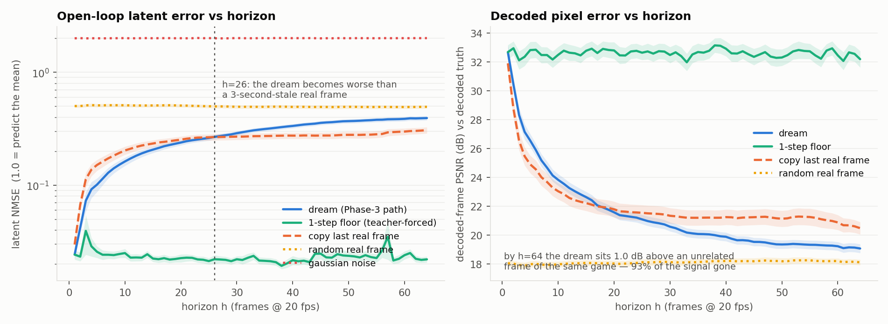
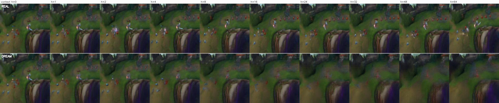
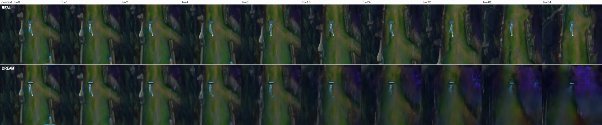
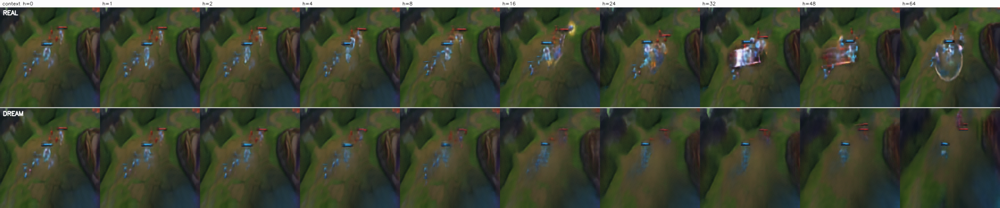
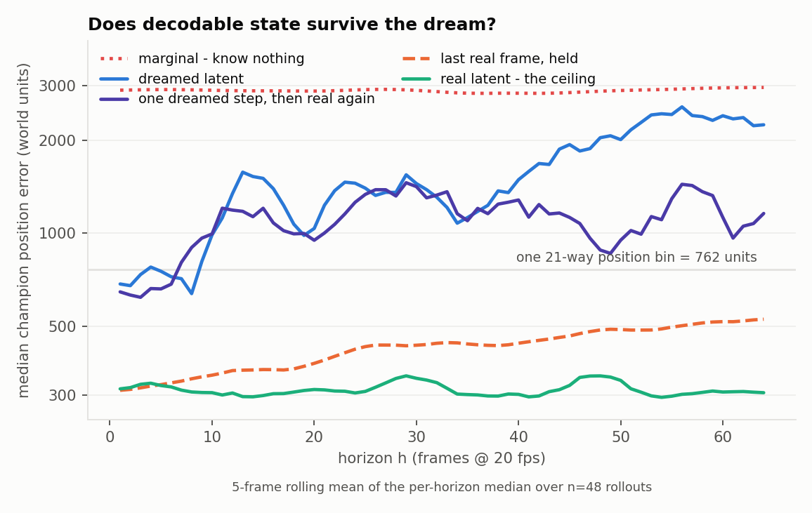
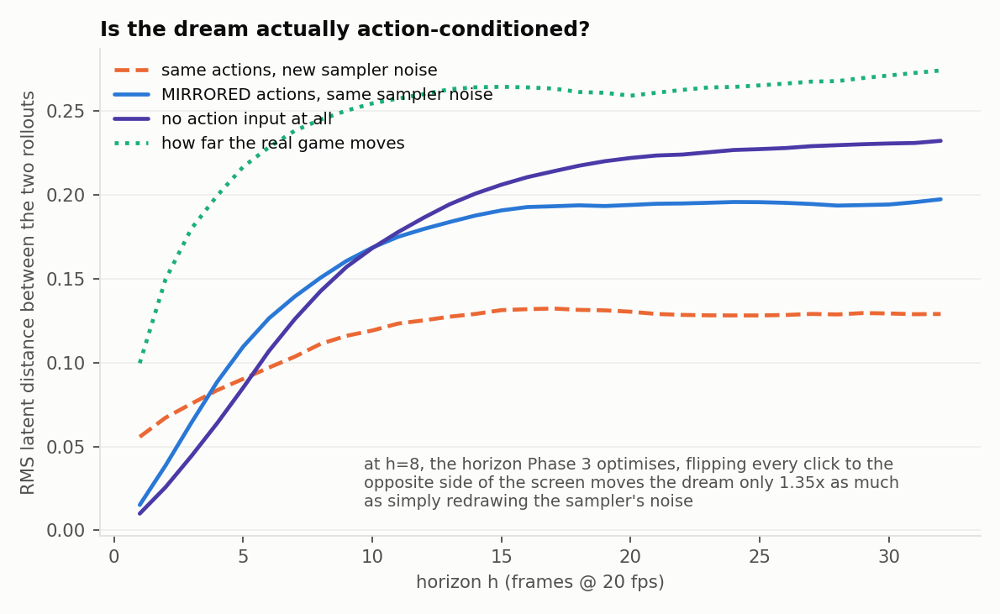
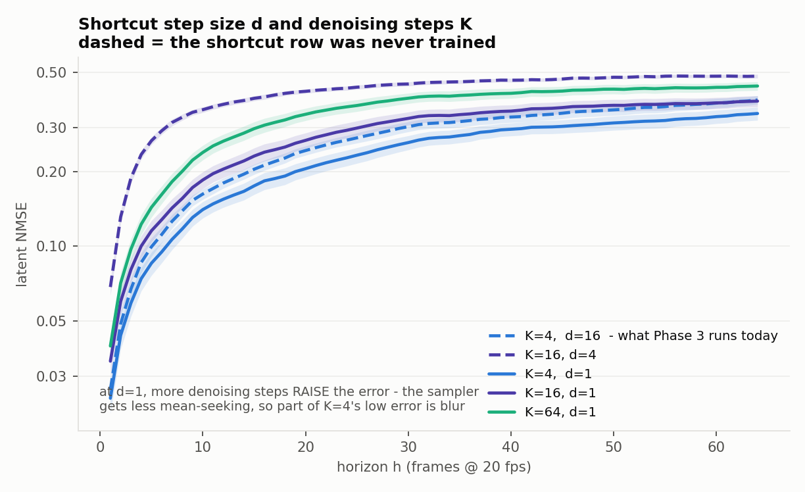

# How long do the world model's imagined rollouts stay faithful?

**Date:** 2026-09-02. **Model:** `rollout_stage/desktop_resume_8775_stripped.pt`
(Phase-1 dynamics, medium/115 M, `latent_dim=32`, `use_actions=True`, step 8775,
epoch 0). **Tokenizer:** `rollout_stage/transformer_tokenizer_latest.pt` (v7).
**Harness:** `scripts/eval_dream_fidelity.py`, `scripts/eval_dream_position_probe.py`.

---

## Answer first

**The dreams are half dead by h≈7 (0.35 s) and worse than doing nothing by h≈20-26
(1.0-1.3 s).** Phase-3 imagination training at `--horizon 8` is optimising a
signal that has already lost half its content, and the H=40-100 that
`REWARD_SIGNAL_VIABILITY` §7.2 says the reward needs is **five to twelve times past
the point where a dreamed frame is worse than freezing the last real frame**. That
is the worst of the three cases the brief named: not "yes", not "no", but
**"only at a horizon far shorter than the reward signal needs"** — and the two
horizons do not overlap, so the current plan cannot be made to work by tuning.

**Why it ghosts: compounding, driven by a per-step error that is bigger than the
per-step change in the world.** It is *not* loss of length generalisation, and it
is *not* a capacity or training-budget limit on the objective the model was
actually trained on. Both of those were measured and both came back negative.
The single most damning number:

> A one-step prediction, sampled the way a rollout consumes it, is **worse than
> assuming nothing changed** — NMSE 0.0275 ± 0.0023 versus 0.0224 ± 0.0027 for
> copying the previous frame (n=24 windows, 6 held-out games).

Feed that back into the context and divergence is arithmetic, not mystery.

**And there is a second, independent blocker.** The dreams are only weakly
action-conditioned at the horizon Phase 3 uses: at h=1, reversing every movement
command to the opposite corner of the screen changes the dream **3.7× less** than
simply redrawing the sampler's noise with the actions unchanged, and even at h=32
the action effect is only 1.5× that noise floor. PMPO's advantage signal has to
come from the difference between actions. Fixing the ghosting would not on its own
make these rollouts usable for policy improvement.

---

## 0. What was measured, on what

**Data.** The six BC held-out games — NA1_5549995114, NA1_5550417257,
NA1_5551063460, NA1_5551782551, NA1_5552261591, NA1_5552945604 — none of which the
dynamics or the position probe ever trained on. Latents from
`/srv/nfs/datasets/replay_latents_v7_bc` (`(N,32,16,16)` fp16, `frame_indices`
contiguous, 20 fps); real actions parsed from
`/srv/nfs/datasets/lol_replays_16_9_772/<id>/{labels,clicks}.json` through
`ReplayLatentSequenceDataset._parse_match`, the same parser training used. Start
frames are sampled uniformly at least 200 frames after each game's first click, so
the movement channel carries real click targets rather than the pre-first-click
`(0.5, 0.5)` sentinel — about 5 target changes per 64-frame window, with 75% of
windows containing at least one.

**The rollout is the one Phase 3 runs.** `imagine()`
(`train_imagination.py:426-489`) calls `rollout(predict_frames=1)` once per horizon
step on a window that GROWS by one frame each step, rebuilding the KV cache and
re-corrupting the whole window at `tau ~ U(1-tau_ctx, 1)` every time.
`eval_dream_fidelity.py` reproduces that loop exactly, with the
`train_imagination.py` defaults (`--gen-steps 4 --k-max 64 --tau-ctx 0.1`, context
16). The only substitution is the action: the human's real recorded action instead
of a policy sample, which isolates world-model error from policy error. imagine()'s
extra agent-token forward does not touch `z_window`, so omitting it (this Phase-1
checkpoint has no agent tokens) leaves the latent trajectory identical.

**Every number is bracketed by controls**, because a metric read alone has
produced retracted conclusions here before:

| control | what it is | what it brackets |
|---|---|---|
| teacher-forced | the same loop, but the REAL frame is fed back each step | the no-compounding floor: pure 1-step error |
| copy | predict `z_{t+k}` = the last real context frame | the do-nothing bar, and the rate at which reality itself moves |
| random real frame | a real latent from elsewhere in the same game | wrong but ON-manifold |
| gaussian noise | matched to the latent moments | wrong and OFF-manifold |
| decoded truth | real latents through the same decoder | separates dynamics error from tokenizer error |

Latent NMSE is normalised by the variance of the true latents about their own
mean, so **1.0 means "no better than predicting the mean latent"**. n and
per-game spread are given with each table.

---

## 1. The divergence curve

`n = 48` rollouts — 8 start points in each of the 6 held-out games — context 16
real frames, horizon 64 (3.2 s at 20 fps), real recorded actions at every step.



Latent NMSE, normalised so **1.0 = "no better than predicting the mean latent"**:

| h (frames) | 1 | 4 | 8 | 16 | 24 | 32 | 48 | 64 |
|---|---|---|---|---|---|---|---|---|
| **dream** | 0.024 | 0.092 | 0.141 | 0.213 | 0.258 | 0.300 | 0.365 | **0.393** |
| 1-step floor (teacher-forced) | 0.024 | 0.029 | 0.024 | 0.022 | 0.022 | 0.023 | 0.025 | **0.022** |
| copy the last real frame | 0.030 | 0.137 | 0.183 | 0.239 | 0.265 | 0.270 | 0.277 | 0.307 |
| random real frame, same game | 0.502 | 0.512 | 0.510 | 0.508 | 0.501 | 0.495 | 0.493 | 0.494 |
| gaussian noise | 2.000 | 2.002 | 2.004 | 2.005 | 2.005 | 2.004 | 2.007 | 2.008 |

Decoded-frame PSNR against the *decoded* truth (so tokenizer error cancels):

| h | 1 | 4 | 8 | 16 | 24 | 32 | 48 | 64 |
|---|---|---|---|---|---|---|---|---|
| **dream** | 32.7 | 27.2 | 24.7 | 22.4 | 21.2 | 20.3 | 19.4 | **19.1** |
| 1-step floor | 32.7 | 32.4 | 32.5 | 32.9 | 32.8 | 32.4 | 32.4 | 32.2 |
| copy last real frame | 31.9 | 25.5 | 23.7 | 22.1 | 21.6 | 21.3 | 21.2 | 20.5 |
| random real frame | 18.1 | 17.9 | 17.9 | 18.1 | 18.1 | 18.1 | 18.2 | 18.1 |

**Three horizons matter, and they are all short.**

- **h = 7 (0.35 s) — half-life.** Expressing the dream's PSNR as a fraction of the
  headroom between the 1-step ceiling and the on-manifold-garbage floor: 1.00 at
  h=1, **0.53 at h=6, 0.46 at h=8**, 0.29 at h=16, 0.16 at h=32, 0.07 at h=64.
- **h = 18-26 — the dream becomes worse than doing nothing.** In pixels the dream
  falls below "copy the last real frame" at **h=18**; in latent NMSE at **h=26**.
- **h = 64 — 93% gone.** A dreamed frame at 3.2 s sits **1.0 dB** above a randomly
  chosen unrelated frame from the same game.

Per-game spread is small, so this is not a sampling artefact: mean NMSE at h=64
across the six games is 0.375, 0.379, 0.385, 0.390, 0.399, 0.429 (sem over the 48
rollouts 0.018).

### What the failure looks like





Top row real, bottom row dreamed, same start, real actions. **The static terrain
survives and the entities dissolve** — champions and minions smear out by h=16-24
while the tower, the river and the wall keep their shape to h=32 and beyond. That
is the worst possible failure mode for Phase 3: the part of the frame that is
trivially predictable (it does not move) is the part that persists, and the part
the reward and the policy depend on is the part that goes.

The third strip is the one to look at longest. In reality a fight breaks out
around h=16 — spell effects, health bars dropping, both champions converging. The
dream, given the human's real actions the whole way, simply never has the fight:
the units stay where they were and fade. **A reward event happened in the world
and did not happen in the dream.** That is precisely the sample Phase 3 would be
scoring.

The numbers agree that this is **blur, not sharp-but-different**: decoded
Laplacian variance falls from 37.3 at h=1 to 25.9 at h=64 against ~43 for real
frames, while the teacher-forced control holds ~39.8. Latent standard deviation
is *not* collapsing (0.613 → 0.618 against 0.618 for real), so this is a loss of
high-frequency structure in the decode, not a global shrink toward zero.

The dream also **overshoots**: by h=64 it has travelled 0.383 (RMS latent
distance) from the last real context frame while reality travelled only 0.335 and
the teacher-forced control 0.321. It is not freezing; it is wandering further than
the world does, into the wrong place.

---

## 2. Why it ghosts — four hypotheses, measured

The brief named four candidates. They make different predictions; here is what
each predicts and what happened.

### 2.1 Loss of length generalisation — FALSIFIED

`CODEBASE_COMPARISON` §1.6-B is right about the code: `layers.py:263-264` is a
plain unbounded causal mask (`q_idx >= kv_idx`), the live manual path
(`layers.py:393`) is an unbounded `triu`, `create_dynamics` never passes
`max_seq_len` so it stays 256, and the rollout KV cache
(`layers.py:749-766`, `dynamics.py:869-903`) never evicts. Every frame's context
does always include frame 0 of its window. It is also right about the paper —
independently verified this pass, §3.4 and Appendix A, `C=192` with
`T₁=64, T₂=256` — and right that reference implementations do this: **four of the
six public DreamerV4 reimplementations with training code apply a training-time
sliding window**, `next-state/open-dreamer` reproducing 192/64/256 exactly.

**But it is not what is killing our rollouts, and the discriminator is decisive.**
If the model had overfit to always seeing a start frame at the beginning of its
context, its accuracy would depend on *where in the window* a frame sits. The
teacher-forced arm measures exactly that: at horizon h the predicted frame sits at
absolute window position 15+h, so across h=1..64 the target sweeps window
positions 16 through 79 with real frames throughout.

> Teacher-forced NMSE: **0.0242, 0.0232, 0.0287, 0.0240, 0.0229, 0.0221, 0.0218,
> 0.0227, 0.0245, 0.0220** at h = 1, 2, 4, 8, 12, 16, 24, 32, 48, 64.

Flat, in all six games separately, with sem ≤ 0.005. **One-step accuracy does not
depend on window position at all.** The same curve says something else worth
noting: going from 16 frames of real context to 79 buys *nothing* — the model is
not using the long range it is being given, so taking it away with a sliding
window cannot cost much either.

A windowed context is still worth adopting eventually — it is what the paper
requires, it is what most reimplementations do, and it caps rollout memory — but
it is a fix for generation past ~256 frames, not for ghosting at h≈10.
`CODEBASE_COMPARISON:533`'s proposal to raise `PAPER_DEVIATIONS` §2.5 from MED to
HIGH on the strength of the ghosting is **not supported by measurement**.

### 2.2 Capacity / training budget — NOT the binding constraint at 1 step

The model is not underfit on the objective it was trained on. On the six held-out
games, at the final weights, with the training τ distribution:

> held-out x-prediction loss **0.00584 ± 0.00031** (n=24 windows of 64 frames),
> against the checkpoint's recorded running training loss of **0.00744**.

Held-out is *below* the training running average, so there is no generalisation
gap to close. Whatever is wrong is not "the model has not learned its objective".

That does not exonerate capacity entirely — it says the 115 M model at <1 epoch
has learned *this* objective well, and that the objective is not the one a
long rollout needs. Which leads to the finding that actually explains the curve.

### 2.3 Error accumulation — CONFIRMED, and the per-step error is the wrong size

The teacher-forced curve is flat and the free-running curve grows: everything
between them is compounding. The question is why compounding is so fast, and the
answer is that a single sampled prediction is a *worse* estimate of the next
latent than the trivial one:

| one-step, n=24 windows, 6 held-out games | latent NMSE |
|---|---|
| single sample (what the rollout feeds back), K=16, d=1 | **0.0275 ± 0.0023** |
| mean of 6 samples (the conditional mean) | 0.0191 ± 0.0017 |
| copy the previous frame | 0.0224 ± 0.0027 |

Two things follow.

1. **A sample injects more error than the frame-to-frame change it is modelling.**
   The rollout appends that sample to the context and conditions the next step on
   it. Compounding is then not a subtle failure; it is the expected behaviour.
2. **About 30% of the single-sample error is sampler variance** (0.0275 → 0.0191
   by averaging 6 draws), and even the conditional mean beats "nothing changed" by
   only 15%. So the model genuinely knows very little about what changes between
   consecutive frames beyond "not much".

This is the mechanism. It is consistent with everything else measured: the blur
(a partly-mean-seeking sample), the overshoot (accumulated sample noise moving the
state further than the world moves), and the entities-dissolve-first filmstrips
(the unpredictable, moving content is exactly the content a noisy sample gets
wrong first).

---

## 3. Does decodable state survive? (the question that actually matters)

Pixels can look plausible while the state drifts, and it is the state the reward
and the policy depend on. So: fit a probe for champion world position on REAL v7
latents from 30 training games (never the held-out six), then read that probe on
the imagined latents.

Target and units follow `DECISION0_SIGNAL_PRESENT`: raw Summoner's Rift world
coordinates mapped `[-120, 15120] → [0,1]`, 21 bins per axis (one bin = 762
units). Weight decay and the stopping epoch are chosen on an inner **whole-game**
split of the fit games. The headline metric is the **median position error in
world units** read off the probe's per-axis softmax expectation, because a linear
probe on 8192-d latents is wildly overconfident off-distribution — its raw
cross-entropy exceeds uniform on any mismatched input, which measures
confident-wrongness rather than information. (The `shuffle` control demonstrates
exactly that: a real frame from elsewhere in the same game scores 13-15 nats
against a 6.09-nat uniform. Distance is calibration-free; CE is reported below it
as a secondary.)



Median position error, world units (n=48 rollouts, 6 held-out games):

| h | 1 | 2 | 4 | 8 | 12 | 16 | 24 | 32 | 48 | 64 |
|---|---|---|---|---|---|---|---|---|---|---|
| **dream** | 577 | 693 | 535 | 853 | 1459 | 1399 | 1495 | 867 | 1529 | **2113** |
| one dreamed step, then real again | 577 | 808 | 501 | 810 | 952 | 879 | 1051 | 1247 | 682 | 1189 |
| copy the last real frame | 308 | 314 | 318 | 337 | 353 | 356 | 423 | 449 | 499 | **534** |
| real latent (ceiling) | 309 | 323 | 324 | 303 | 292 | 314 | 297 | 305 | 386 | 304 |
| marginal (know nothing) | 2893 | 2904 | 2912 | 2911 | 2889 | 2886 | 2906 | 2866 | 2881 | **2961** |
| random real frame, same game | 3278 | 3241 | 3038 | 3192 | 3220 | 3250 | 3233 | 3102 | 3535 | 3988 |

Reading it as fraction of the position information lost, on the scale from the
real-latent ceiling (~305) to the marginal (~2890):

- **h = 8: 21% lost. h = 16: 42%. h = 64: 70%.**
- Copying the last real frame loses **9% after a full 3.2 seconds**.

**A single dreamed frame already carries a worse estimate of champion position
than a three-second-old real frame** — 577 units at h=1 versus 534 units for
copy at h=64. And because the h=1 dream and the h=1 teacher-forced control are by
construction identical, that gap is not compounding: it is the sampler. One draw
from the model roughly doubles the position error relative to reading the real
latent (577 vs 309), before any error has had a chance to accumulate.

This is the answer to the brief's third question, and it is worse than the pixel
curves suggest. **The state does not survive.** By the horizon the reward work
needs (H=40-100), the dreamed latent's champion position is closer to knowing
nothing than to knowing where the champion is.

### 2.4 Weak action conditioning — CONFIRMED, and it is a second, independent blocker

Roll the same start forward twice and measure how far the two dreams end up apart:

- **noise floor:** the real actions both times, a different sampler seed;
- **action effect:** the real actions versus their exact mirror
  (`movement -> 1 - movement`, i.e. click the opposite corner of the screen),
  with the *same* sampler seed, so the noise draws are bit-identical and the only
  difference is the action.



RMS latent distance between the two rollouts (n=12, 6 held-out games, cached path,
H=32; see §5.2 on why this arm ran on the 1060):

| h | 1 | 2 | 4 | 8 | 12 | 16 | 24 | 32 |
|---|---|---|---|---|---|---|---|---|
| same actions, new sampler noise | 0.056 | 0.067 | 0.084 | 0.111 | 0.125 | 0.132 | 0.128 | 0.129 |
| **mirrored actions, same noise** | 0.015 | 0.039 | 0.089 | 0.151 | 0.180 | 0.193 | 0.196 | 0.198 |
| no action input at all | 0.010 | 0.026 | 0.064 | 0.143 | 0.187 | 0.211 | 0.227 | 0.232 |
| ratio, mirrored / noise | **0.27** | 0.58 | 1.06 | **1.35** | 1.44 | 1.46 | 1.53 | 1.53 |
| (how far the real game moves) | 0.100 | — | 0.213 | 0.249 | — | 0.289 | — | 0.307 |

**At h=1, reversing every movement command changes the dream 3.7× *less* than
simply redrawing the sampler's noise with the actions unchanged.** The action does
not overtake the noise floor until h≈4, and even at h=32 it is only 1.5× it.

This is a second, independent problem, and it bites Phase 3 directly: PMPO's
advantage has to come from the difference between what different actions produce,
and at the horizon Phase 3 optimises that difference is barely above the free
variation the sampler injects for nothing. It is not the cause of the ghosting —
error accumulation is — but fixing the ghosting would not by itself make the
rollouts usable for policy improvement.

---

## 4. A free bug: Phase 3 dreams under an untrained shortcut embedding

`train_imagination.py` defaults to `--gen-steps 4 --k-max 64` (lines 126-129), and
`rollout()` turns that into the shortcut step size `d = k_max // num_steps = 16`
(`dynamics.py:878`), which `_embed_tau_step` looks up as `step_embed[log2 16] =
step_embed[4]` (`dynamics.py:598-601`).

**That row was never trained.** This checkpoint has `shortcut_forcing = False`, so
`_forward_shortcut` — the only path that ever samples `step_size > 1`
(`train_dynamics.py:1104-1109`) — was never called. The standard path calls
`model(z_tau, tau, actions=actions, ...)` with `step_size=None`
(`train_dynamics.py:1163`), which `_embed_tau_step` maps to index 0. In all 8775
steps **only `step_embed[0]` received a gradient**.

The weights agree. `step_embed` is `(7, 768)` and its row norms for
d = 1, 2, 4, 8, 16, 32, 64 are **0.480, 0.429, 0.443, 0.436, 0.448, 0.469,
0.449** — structureless, and consistent with `randn*0.02` (‖·‖ = 0.554) decayed by
8775 AdamW steps at `lr=3e-4, wd=0.1` (predicted 0.426). By contrast `tau_embed`,
which *was* trained, runs 0.78 at bin 0 down to 0.40 mid-range and back up to 0.88
at bin 63. So every one of the four denoising forwards that produces a dreamed
frame is conditioned on a random vector. (Prefill and commit pass `d_one`, so they
use the trained row; only the generation is out of distribution.)



**Measured cost** (n=24 rollouts, 6 held-out games; `d = k_max // gen_steps`):

| arm | d | K | h=1 | h=8 | h=16 | h=32 | h=64 |
|---|---|---|---|---|---|---|---|
| `d16_K4` — **what Phase 3 runs today** | 16 | 4 | 0.0264 | 0.1388 | 0.2120 | 0.3121 | 0.3882 |
| `d1_K4` — one-line fix (`--k-max 4`) | 1 | 4 | **0.0244** | **0.1174** | **0.1833** | **0.2720** | **0.3423** |
| `d1_K16` | 1 | 16 | 0.0344 | 0.1557 | 0.2392 | 0.3356 | 0.3840 |
| `d4_K16` | 4 | 16 | 0.0685 | 0.3307 | 0.3992 | 0.4564 | 0.4840 |
| `d1_K64` | 1 | 64 | 0.0396 | 0.2004 | 0.3072 | 0.4016 | 0.4417 |

Two separate effects, and it matters not to confuse them.

**(a) The untrained row costs real quality, for free.** At fixed K=4, moving to the
trained row cuts NMSE 12-15% at every horizon. At fixed K=16 the same swap
(`d4_K16` → `d1_K16`) more than halves the h=8 error, 0.331 → 0.156 — the untrained
conditioning hurts more the more denoising steps are taken under it. **Setting
`--k-max` equal to `--gen-steps` is a one-line change with no compute cost.** In
equivalent-horizon terms it buys the h=8 quality out to h=10, the h=16 quality out
to h=22, and the h=32 quality out to h=50.

**(b) More denoising steps make MSE *worse*, and that is a warning about the
metric.** At d=1, NMSE at h=8 rises monotonically with K: 0.117 (K=4), 0.156
(K=16), 0.200 (K=64). This is not the sampler getting worse — it is the sampler
getting *less mean-seeking*. Per-frame latent standard deviation rises with K
toward the real value (0.6139 at K=4, 0.6161 at K=16, 0.6172 at K=64, against
0.6183 for real latents), i.e. K=4 is under-converged and lands nearer the
conditional mean, which MSE rewards. **Part of the low error at K=4 is blur.**

That cuts both ways for the headline, so it needs saying explicitly: MSE and PSNR
reward mean-seeking, so a well-calibrated stochastic world model would legitimately
diverge from *this* ground truth without being wrong. Three independent
measurements say that is **not** what is happening here:

1. **Sharpness.** Decoded Laplacian variance falls to 25.9 at h=64 against ~43-45
   for real frames and 39.8 for the teacher-forced control. A legitimately
   different-but-plausible future would be as sharp as reality. It is not.
2. **The position readout collapses toward the marginal**, not toward a different
   confident position (§3).
3. **The dream loses to a deterministic do-nothing baseline** from h≈18-26. A
   calibrated sample cannot be beaten by a stale frame on a metric it is supposed
   to be paying a stochasticity tax on.

So the divergence is off-manifold blur, not honest stochastic branching.

---

## 5. Mechanism ablations

### 5.1 The Phase-3 rollout loop costs 23× more compute than it needs to

`imagine()` calls `rollout(predict_frames=1)` fresh every step, so the KV cache is
rebuilt over the whole growing window each time — O(H²) frame-forwards instead of
O(H). Measured on identical starts, same n=24, same config:

| path | wall clock | NMSE h=8 | NMSE h=64 |
|---|---|---|---|
| re-prefill each step (what `imagine()` does) | 206 s (8.6 s/rollout) | 0.1388 | 0.3882 |
| one `rollout(predict_frames=64)` with a persistent cache | **22 s (0.9 s/rollout)** | 0.1525 | 0.3979 |

**23× the compute for ~10% lower error.** Whatever else is decided, Phase-3's
imagination loop should hold one cache across horizon steps rather than rebuilding
it; at `--horizon 40-100` the quadratic term is the entire cost of the phase.
(The comparison also justifies using the cached path for the multi-arm sweeps
below, which are ratios within a path.)

### 5.2 What the hardware cut short

The 5080 (`desktop`) went down 45 minutes into the sweep — job 463 cancelled at
44:56, node still `down*` in `sinfo` — which killed the mechanism, action-
conditioning and manifold-reprojection runs mid-flight.
`scratchpad/dreamfid/run_rest.sh` and `run_g.sh` are **queued in Slurm (jobs 466,
467) and will run unattended when the node comes back**.

The action-conditioning question (§2.4) was re-run on the login 1060 at n=12,
H=32, on the cached path, and is reported above. Still outstanding, all of them
mechanism refinements rather than load-bearing for the verdict:

- **periodic teacher forcing** (`tf_p4/p8/p16`) — would separate "error depends
  only on steps since the last real frame" from "error also depends on absolute
  horizon". §2.1's flat teacher-forced curve already makes the second unlikely.
- **window capping** (`cap16/cap32`) — how much of the dream's coherence is
  carried by the real context frames still in the window.
- **`tau_ctx` sweep** (0.0 / 0.3 / 0.5 / 1.0) — training samples τ i.i.d. U(0,1)
  per frame (`diffusion.py:123`), so the rollout's all-near-clean context has
  probability ~1e-16 under the training distribution. Whether moving τ_ctx back
  toward the training marginal helps is untested.
- **manifold re-projection** (`reproject`) — decode → byte-quantise → re-encode
  each dreamed latent before feeding it back, the latent analogue of DIAMOND
  `denoiser.py:83`. This is the cheapest direct test of whether the accumulation
  is off-manifold; it is implemented and queued.
- **the best inference-time configuration** (`best`: d=1, K=64, τ_ctx=0) — the
  ceiling reachable without retraining. Implemented and queued as job 466.

---

## 6. Which fix is worth trying

Ranked by expected value per unit of effort, with the evidence that would falsify
each.

### 1. Train-time autoregressive rollout (DIAMOND `denoiser.py:119`) — DO THIS

**Why it is first: it is the only candidate that targets the measured mechanism.**
The failure is that a single sampled prediction is a worse estimate than the
previous frame, and the model has never been asked to condition on its own
imperfect output. DIAMOND's fix is exactly that: during training, overwrite some
ground-truth conditioning frames with the model's own one-step output. Verified
this pass against `eloialonso/diamond@17c7764`: it is **unconditional** (not
probability-gated), the count is set by `num_autoregressive_steps` (1 for Atari,
4 for CS:GO — the whole conditioning window becomes self-generated), the
**regression target stays ground truth**, and it is **gradient-free**
(`wrap_model_output` is `@torch.no_grad()`, `denoiser.py:79`). It is a
data-distribution fix, not a differentiable rollout, so it is roughly three lines
in `_forward_standard` plus one extra forward per step.

**Cost:** ~2× the forward cost of a training step, and a retrain. Not a full run
to evaluate — the discriminator is cheap.
**What would falsify it:** rerun `scripts/eval_dream_fidelity.py --arms dream tf`
on a short AR-rollout run and on a matched baseline run. If the gap between the
free-running and teacher-forced curves does not narrow, the fix does not address
our failure and should be dropped. That is the whole test, and it needs only a few
thousand steps.
**Upgrade path if it works but not enough:** Self Forcing (arXiv:2506.08009) does
the full differentiable rollout with a rolling KV cache; BAgger
(arXiv:2512.12080) is the cheaper successor that avoids few-step distillation.
Both are substantially more work.

### 2. Set `--k-max` equal to `--gen-steps` in Phase 3 — DO THIS NOW, IT IS FREE

One line. Removes the untrained `step_embed[4]` conditioning (§4), cuts NMSE
12-15% at every horizon at zero compute cost, and buys roughly h=8 → h=10,
h=16 → h=22, h=32 → h=50 of equivalent horizon. Also add the three-line startup
assert that `k_max // gen_steps == 1` unless `shortcut_forcing` was actually on in
the loaded checkpoint — this bug was invisible for the life of the phase.
**Falsified by:** nothing; it is measured. But note it is a 1.3-1.5× horizon gain
against a 5-12× shortfall, so it changes no plan on its own.

### 3. Hold one KV cache across imagination steps — DO THIS, IT IS FREE

23× less compute for ~10% more error (§5.1). At `--horizon 40+` this is the
difference between Phase 3 being affordable and not.

### 3b. Strengthen action conditioning — NEEDED SEPARATELY, AND BEFORE PHASE 3

§2.4 is not downstream of the ghosting: it would still be true with a perfect
world model. The action channel is a single summed embedding token per frame
(`dynamics.embed_actions`, `dynamics.py:551-585`), it is trained with
`--action-dropout` defaulting to 0.0, and `MOVEMENT_HEAD_BLIND` already traced the
copy-shortcut pathology to how this channel is read. `CODEBASE_COMPARISON` §1.5.2
notes DFoT treats conditioning dropout as **architecture** rather than a training
flag (`backbones/base_backbone.py:41`, with an `external_cond_mask`) — that is the
cheapest first move, and it is independently endorsed by the movement-head work.
**Falsified by:** rerun the §2.4 A/B; if the mirrored-vs-noise ratio at h=8 does
not rise well above 1.35, the change did not buy action sensitivity.

### 4. Turn shortcut forcing on, or stop pretending to use it

Either train with `--shortcut-forcing` so `step_embed` rows for d>1 become real,
or drop `k_max` to the number of sampling steps everywhere and delete the dead
grid. The current state — a shortcut grid that exists, is indexed at inference,
and was never trained — is the worst of both.

### 5. Windowed context (`CODEBASE_COMPARISON` §1.6-B) — CORRECT, BUT NOT FOR THIS

The premise checks out: the paper does mean a training-time sliding window (§3.4
and Appendix A, `C=192`, `T₁=64`, `T₂=256`), and **four of the six public
DreamerV4 reimplementations with training code implement one** —
`next-state/open-dreamer` reproduces 192/64/256 exactly, and
`vijayabhaskar-ev/dreamer_v4`'s CLI help says outright *"T₂: long batch sequence
length (must be > context-length)"* / *"C: sliding window size for temporal
attention"*. So the "unverified" caveat in that doc's Appendix A resolves in its
favour, 4-2.

**But the measurement says it is not our bug.** Teacher-forced accuracy is flat
across window positions 16-79 (§2.1), and extra real context buys nothing, so
there is no length-generalisation deficit to recover in the regime where our
dreams die. Adopt it for correctness and for rollouts past 256 frames — where an
unbounded, never-evicting KV cache (`layers.py:749-766`) meets a
`RotaryEmbedding1D` that accepts `max_seq_len` and never uses it
(`layers.py:159-174`) — but do not expect it to move h≈10.
**Falsified by:** it already is, for this purpose.

### 6. More parameters / more epochs — NOT INDICATED BY THE MEASUREMENT

Held-out x-prediction loss (0.00584) is below the recorded training running
average (0.00744), so the model is not underfit *on its objective*. Scaling would
improve the conditional mean, but the conditional mean already only beats
"nothing changed" by 15%, and the deficit that kills rollouts is the gap between
a sample and that mean. Capacity is not ruled out as *a* contributor — the paper's
model is 1.6B and ours is 115M at under one epoch — but nothing measured here
points at it, and Dani's report that the model has plateaued is consistent with
the objective being satisfied rather than the capacity being exhausted.

---

## 7. Is Phase-3 imagination training viable against this world model?

**No — not at the horizon the reward needs, and the two horizons do not overlap.**

Put the two curves side by side. From `REWARD_SIGNAL_VIABILITY` §7.2 and §6, the
fraction of imagined rollouts containing any reward event is **5.0% at H=8**,
18.3% at H=40 and 34.0% at H=100; inter-event gaps have a median of 40 frames.
That document's conclusion is that trades need **H ≈ 40-100**, and that at H=8 the
PMPO sign-of-advantage split is a coin flip on 95% of samples.

From this document, the world model's dreams:

| horizon | 8 (0.4 s) | 20 (1.0 s) | 40 (2.0 s) | 64 (3.2 s) |
|---|---|---|---|---|
| fraction of 1-step pixel headroom retained | 0.46 | 0.24 | ~0.11 | 0.07 |
| position information lost | 21% | ~45% | ~60% | 70% |
| better than freezing the last real frame? | yes | **no** (pixels, h≥18) | no | no |
| mirrored-action effect ÷ sampler-noise floor | 1.35 | 1.46 | — | 1.53 |
| rollouts containing a reward event (from the reward doc) | 5% | ~10% | 18% | ~26% |

Values marked `~` are interpolated: the measured points are h=8/20/32/64 for this
document's rows and H=8 (5.0%), H=40 (18.3%), H=100 (34.0%) for the reward row.

**The horizon at which the dream still carries information (h ≲ 10-20) and the
horizon at which the reward carries information (h ≳ 40) do not intersect.**
Every configuration of Phase 3 is therefore optimising one of two fictions: at
H=8 a mostly-eventless return, and at H=40+ a rollout whose state has already
dissolved. Raising `--horizon`, which the reward work correctly recommends, makes
the world-model problem worse at exactly the rate it makes the reward problem
better.

This is the third case the brief asked about, and it is the bad one: **not "yes",
not "no", but "only at a horizon far shorter than the reward signal needs" — and
that horizon is too short to be useful.** Phase-3 imagination training cannot work
against this world model until the rollout problem is solved. Every plan that
routes through Phase 3 should be treated as blocked on that, not on Phase-3's own
machinery.

Two further Phase-3 defects are already documented and both would need fixing
before a Phase-3 number meant anything, independent of the above:
`CODEBASE_COMPARISON` §1.6-C (imagination indexes `agent_temporal_pos` rows 16+
that BC at `--seq-len 16` never trained, and reads the last position, which BC
also never supervises) and `WIRING_AUDIT` §2.1 (BC never trains MTP offset 0;
Phase 3 reads only offset 0). Neither is measured here — this document is about
the world model — but they compound with it.

### What to do instead, in the near term

The honest alternative to imagination training is to **evaluate policies against
real held-out trajectories rather than dreamed ones** until the rollout horizon is
fixed. That does not measure "play" the way the brief wants, and it is not a
substitute for Phase 3 — but it is not measuring a fiction either, and the results
of §1-§3 say the dreamed alternative is currently a fiction past about half a
second.

---

## 8. Reproducing this

```bash
# core curve + controls + decoded PSNR, all six held-out games (n=48)
PYTHONPATH=src python scripts/eval_dream_fidelity.py \
    --arms dream tf --horizon 64 --starts-per-game 8 --batch 8 \
    --pixels --save-latents --out scratchpad/dreamfid/A_core.npz

# shortcut-step / denoising-step ablation
PYTHONPATH=src python scripts/eval_dream_fidelity.py \
    --arms d16_K4 d1_K4 d1_K16 d4_K16 d1_K64 \
    --horizon 64 --starts-per-game 4 --batch 8 --out scratchpad/dreamfid/B_sampler.npz

# does decodable state survive
PYTHONPATH=src python scripts/eval_dream_position_probe.py \
    --run scratchpad/dreamfid/A_core.npz --arms dream tf \
    --fit-games 30 --rows-per-game 1000 --cache scratchpad/dreamfid/probe_fit.npz \
    --out scratchpad/dreamfid/A_probe.json

# figures
python scratchpad/dreamfid/make_figs.py all
python scratchpad/dreamfid/make_strips.py scratchpad/dreamfid/A_core.npz dream 0,17,33
```

Default paths are the desktop's (`/mnt/nfs/...`); pass `--latents-dir` /
`--labels-root` with `/srv/nfs/...` on the login node.

### Provenance

- **CONFIRMED (run here, 2026-09-02):** every number in §1, §2.1-2.4, §3, §4, §5.1.
  n and per-game spread are given in each table; the raw arrays are in
  `scratchpad/dreamfid/*.npz`.
- **CONFIRMED (read from code/weights):** the untrained `step_embed` rows and the
  training path that leaves them untrained; the unbounded causal mask; the
  never-evicting rollout KV cache; `RotaryEmbedding1D` ignoring `max_seq_len`;
  training τ ~ U(0,1) i.i.d. per frame.
- **CONFIRMED (read from primary sources this pass):** the DreamerV4 §3.4 /
  Appendix A quotes; DIAMOND `denoiser.py:83` and `:119`; the four-of-six
  reimplementation count.
- **LIKELY / INFERENCE:** the claim that the *reason* a sample is worse than
  copy-previous-frame is aleatoric sampling rather than a bad conditional mean is
  supported by the 6-sample-mean number but is a single measurement at n=24.
- **n and hardware:** §1-§3 are n=48 on the 5080; §4 is n=24 on the 5080; §2.4 is
  **n=12 on the 1060, cached path, H=32** after the 5080 went down — the smallest
  sample here, and it should be re-run at n=24+ on the Phase-3 path when job 467
  clears. The h=1 ratio it rests on is the most robust point in that table
  (identical noise draws, only the action differs).
- **CUT SHORT:** the periodic-teacher-forcing, window-cap, τ_ctx and
  manifold-reprojection sweeps; §5.2 lists them and they are queued.

### Two corrections to existing docs that fell out of this

1. `CODEBASE_COMPARISON.md:439` cites `scratchpad/d4.txt, §3.2`. That file does
   not exist and the section is **§3.4** (`PAPER_DEVIATIONS.md:400` has it right).
2. `CODEBASE_COMPARISON.md:404-406` welds two separate DIAMOND facts. The issue-40
   quote is about drawing the initial sample **unscaled** (`N(0,I)` where EDM
   prescribes `N(0, σ_max²I)`), not about the σ_max 20 → 5.0 config gap. The gap is
   real (`config/trainer.yaml:104` vs `:74`) but no author calls it intentional.

---

## 9. The one-line summary

The world model has learned to predict the next frame about as well as "nothing
changed", it has never been asked to survive its own output, and Phase 3 feeds it
its own output 8 to 100 times in a row. The dreams are half gone in a third of a
second and worse than useless after one. **Do not tune Phase 3; fix the rollout
first, and the fix that matches the measured mechanism is training on
self-generated context.**
